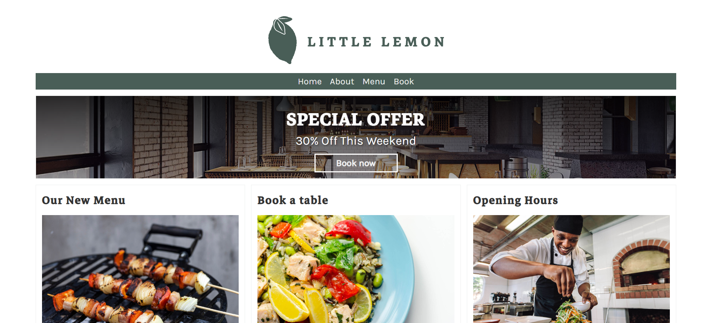
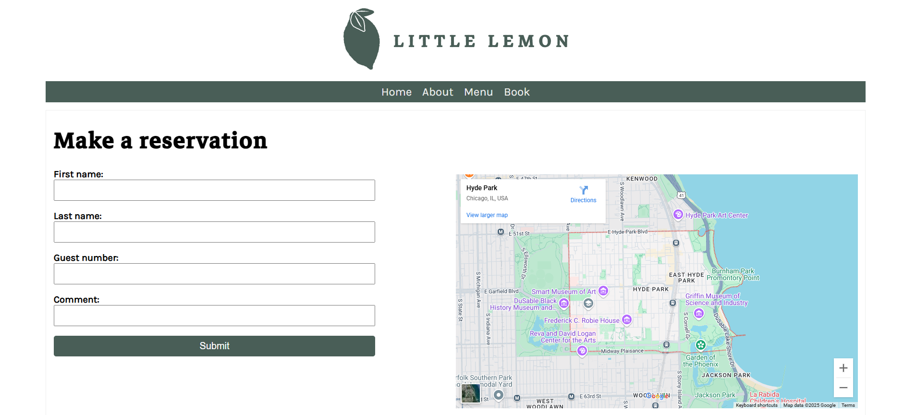

# Little Lemon Restaurant website 📝

This is my first **Django** project: a simple website for a restaurant.  
I built it by following a FreeCodeCamp YouTube tutorial by **Code with Abel**.
 
https://www.youtube.com/watch?v=0roB7wZMLqI&list=LL&index=6&t=2s

---

## Features 🚀
- A home page 
- View items in menu and detailed description of each. 
- Reserve a table for a given time for a number of people 

---

## Screenshots 📷

### Home Page
Here’s what the home page looks like:  

### Booking a table 
Enter your name, the number of guests and any prerequisites if any  

